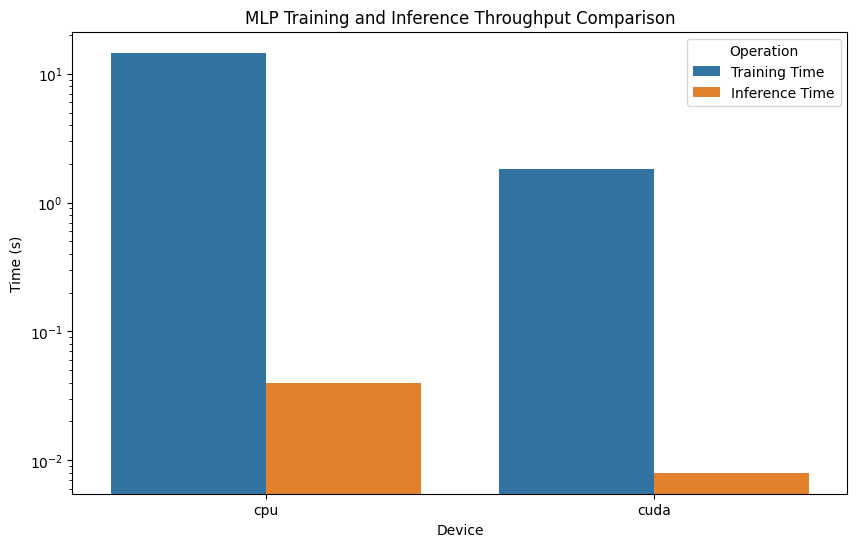

# BM40A1401 GPU Computing - Project Report

Date: Apr 1, 2024
Group: 14
Member: Tornike Onoprishvili (SN: 001720114)
Responsibilities: Everything

# Introduction

In this short report, we describe our work with learning KNN and MLP models on the given dataset. The main focus of the report is the utilization of GPU for accelerated learning. The report contains three parts. The first part discusses the dataset. The second part describes the work for kNN, and the last part discusses MLP-related results. We conclude the report with a short summary.

# Data

The dataset contains 4000 samples and 10 features (continuous variables). There are *in principle* 10 classes. That is, each sample can have a label that ranges from 0 to 10. However, in practice, we only encounter 7 classes: 3, 4, 5, 6, 7, 8, 9. The rest of the classes aren't present in the dataset.


There are no missing or NaN values in the dataset. And the classes are highly imbalanced.


Using pair-plot, we also inspect if any feature (or a combination of these) can form a good classifier, but we don't see such a combination.

We also notice that features will likely need normalization.

In Python, we load the dataset using Pandas and set the train and validation splits at 80/20.

# kNN

The main challenge with kNN is the complexity of distance calculation. We defer this calculation to GPU, using a CuPy's RawKernel function.

We construct the kernel for the critical distance evaluation part using a simple for-loop accumulation inside the kernel. The accumulator is returned from the kernel, and we apply the square root to it afterward.

This implementation is extremely simple. However, while we are aware that it is more efficient to first load the data into the GPU S-RAM to avoid loading each row and column of the two arrays many times, our implementation is simple to write and understand, and for the given size (4000) of the dataset, wholly sufficient.


We implement a classic Euclidean distance kernel and use it to implement the `CuKNN` class that performs the Euclidean k-nearest neighbor learning.

We note that using kNN, we get quite poor results, even with a comprehensive grid-search for best validation `n_neighbors` param:


The best validation accuracy is ~33%, and the best K is 3. In order to make sure that the CuKNN was actually learning (i.e. the distance kernel was working), we also train a dummy classifier (uniform random predictor) and compare the results. We can clearly see that the KNN is learning, but results are still poor.

# MLP

We next turn to finding the simplest possible MLP that can reliably classify the samples in the given dataset.

```py
class MLP(nn.Module):
    def __init__(self, n_feat, n_hid, n_out):
        super().__init__()
        self.norm = nn.BatchNorm1d(n_feat)
        self.ff1 = nn.Linear(n_feat, n_hid)
        self.ff2 = nn.Linear(n_hid, n_hid) 
        self.out = nn.Linear(n_hid, n_out) 
    def forward(self, x):
        x = self.norm(x) 
        x = F.relu(self.ff1(x))
        x = F.relu(self.ff2(x))
        x = self.out(x)
        return x
```

We begin the network with BatchNorm layer since it allows us to skip the usual normalization step for the dataset.

We utilize only two hidden layers, with 2048 neurons each, and a classification head, with 10 outputs (same number as classes). We only use ReLU activations.

We use a relatively high batch-size of 64, since in imbalanced class regime, high-batch size is more likely to include the outlier classes too, and thus resulting in model gradients that include the rare class information too. We double the validation batch size (128) since we don't have to store activations for a backward pass here.

To accelerate learning, we use AdamW optimizer (SGD was eliminated, since without acceleration, it is very slow to converge).

With this setup, we reliably get to ~61% validation accuracy at 10 epochs.



We additionally compare the training and inference times for CPU and CUDA, and find that (on the log scale, above), CPU is roughly 220x times slower for training, and over 200x slower for inference.


# Conclusion

In this report, we explored the benefits of using GPU for large-scale data processing and learning. We first created a custom kernel to efficiently perform kNN learning on a relatively large dataset, and we then used the `torch.nn` and `torch.autograd` tools to create a simple MLP and implemented a basic training and eval loop for it. We found that using GPU for training MLP results in several orders of magnitude faster training and inference.

# References

- BatchNorm:
    Sergey Ioffe and Christian Szegedy. (2015). Batch Normalization: Accelerating Deep Network Training by Reducing Internal Covariate Shift. arXiv:1502.03167.

- kNN:
    Fix, Evelyn; Hodges, Joseph L. (1951). Discriminatory Analysis. Nonparametric Discrimination: Consistency Properties (PDF) (Report). USAF School of Aviation Medicine, Randolph Field, Texas.

- PyTorch:
    Adam Paszke et al. (2019). PyTorch: An Imperative Style, High-Performance Deep Learning Library. In Advances in Neural Information Processing Systems 32, pp. 8024-8035. Curran Associates, Inc. [Online]. Available: http://papers.neurips.cc/paper/9015-pytorch-an-imperative-style-high-performance-deep-learning-library.pdf